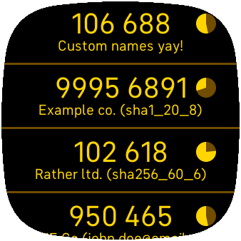
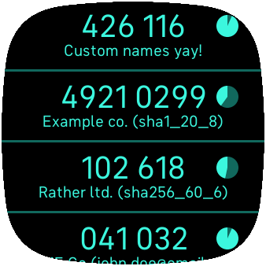
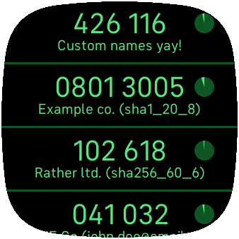
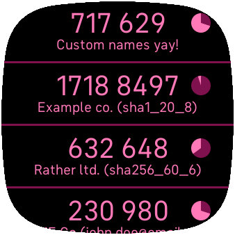
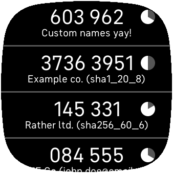
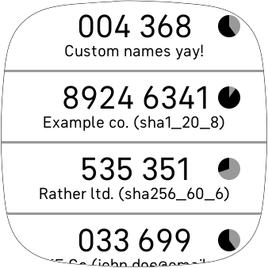
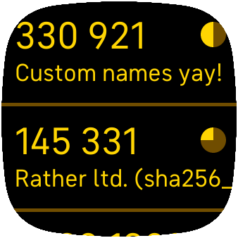
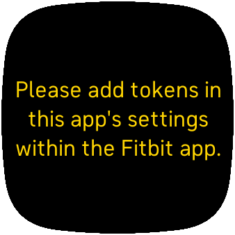

# [fitbit-otp-auth-app](https://github.com/remigius42/fitbit-otp-auth-app)

Copyright 2023 binary poetry gmbh. All rights reserved.

With `fitbit-otp-auth-app` you can store your [time-based one time
passwords
(TOTP)](https://en.wikipedia.org/wiki/Time-based_one-time_password) on
your Fitbit device (currently Versa 3 and Sense) either by scanning a QR
code within the app settings or by entering the TOTP settings manually.

  
  
  
  
  
  
  
  

## Features

- [Add tokens using your smartphone camera](https://remigius42.github.io/fitbit-otp-auth-app/app/#tokens)
- [Add tokens by entering the configuration manually](https://remigius42.github.io/fitbit-otp-auth-app/app/#add-token-manually)
- [Customize the name displayed for your tokens](https://remigius42.github.io/fitbit-otp-auth-app/app/#tokens)
- [Reorder the tokens in any way you like](https://remigius42.github.io/fitbit-otp-auth-app/app/#tokens)
- [Store tokens on the smartwatch to not have to be connected to your smartphone](https://remigius42.github.io/fitbit-otp-auth-app/app/#store-tokens-on-smartwatch)
- [Enlarge the token list for better readability](https://remigius42.github.io/fitbit-otp-auth-app/app/#enlarge-token-information)
- [Compensate the potential clock drift of your smartwatch](https://remigius42.github.io/fitbit-otp-auth-app/app/#compensate-clock-drift)
- [Choose out of 6 different color schemes](https://remigius42.github.io/fitbit-otp-auth-app/app/#color-scheme)

## Usage

If you would like to know how to use this app, please have a look at the <a
href="https://remigius42.github.io/fitbit-otp-auth-app/#user-documentation">end-user
documentation</a>.

## Contributing

Thanks for your interest in contributing! There are many ways to contribute to
this project. Get started by having a look at
[CONTRIBUTING.md](./CONTRIBUTING.md).
