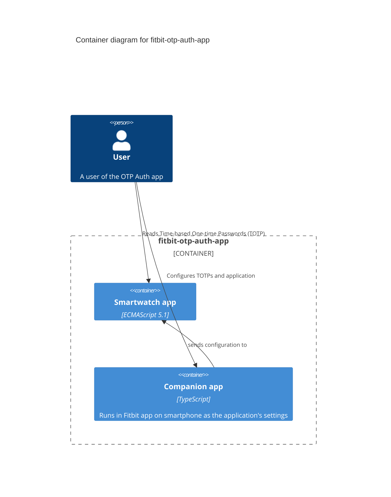
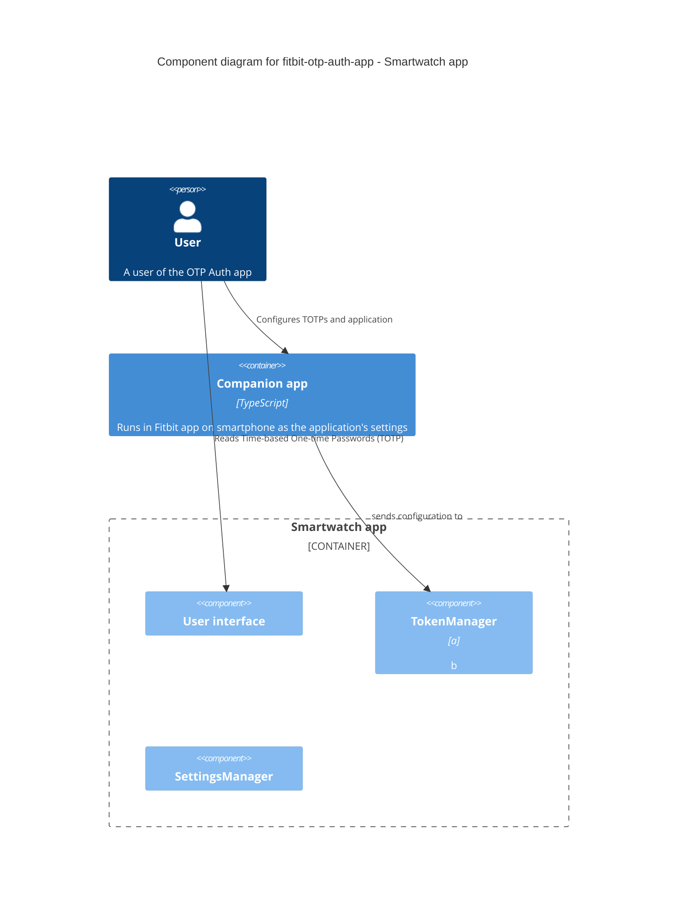

# Building Block View

## White-box Overall System

**_\<Overview Diagram>_**

Motivation  
_\<text explanation>_

Contained Building Blocks  
_\<Description of contained building block (black boxes)>_

Important Interfaces  
_\<Description of important interfaces>_

### \<Name black box 1>

_\<Purpose/Responsibility>_  
_\<Interface(s)>_  
_\<(Optional) Quality/Performance Characteristics>_  
_\<(Optional) Directory/File Location>_  
_\<(Optional) Fulfilled Requirements>_  
_\<(optional) Open Issues/Problems/Risks>_

### \<Name black box 2>

\<black box template>

### \<Name black box n>

\<black box template>

### \<Name interface 1>

…

### \<Name interface m>

## Level 2

### White Box _\<building block 1>_

\<white box template>

### White Box _\<building block 2>_

\<white box template>

…

### White Box _\<building block m>_

\<white box template>

## Level 3

### White Box \<\_building block x.1\_\>

\<white box template>

### White Box \<\_building block x.2\_\>

\<white box template>

### White Box \<\_building block y.1\_\>

\<white box template>
